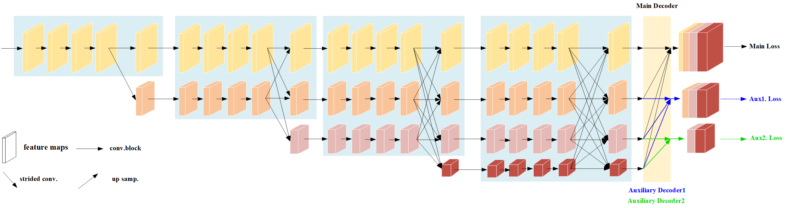

# aux-HRNet

## Introduction

HRNet (High-Resolution Network)  has achieved high scores on many tasks of semantic segmentation and instance segmentation. And HRNetV2 was proposed for semantic segmentation. This work applied auxiliary learning on the basis of HRNetV2, using two auxiliary decoders added to the main decoder. The structure of **aux-HRNet** is illustrated as follows.



## Dataset

We produced a dichotomous remote sensing dataset named '**singlegreen**' for the identification of urban community green spaces (UCGS). 


An example of a labeled image is shown below.

<table rules="none" align="center">
	<tr>
		<td>
			<center>
				
				<br/>
				<font color="AAAAAA">rawdata</font>
			</center>
		</td>
		<td>
			<center>
				
				<br/>
				<font color="AAAAAA">labeldata</font>
			</center>
		</td>
	</tr>
</table>
In labeldata, UCGS is marked in red(RGB=[128,0,0]), and black(RGB=[0,0,0]) is the background.
And the structure of our dataset is modeled after the cityscapes dataset. The split.py file is used to obtain the filenames of the images in the training dataset and stored separately in the splits folder.

```
├── singlegreen
│   ├── rawdata
│   │   ├── train
│   │   ├── val
|   |   ├── test
│   ├── labeldata
│   │   ├── train
│   │   ├── val
|   |   ├── test
|   ├── splits
│   │   ├── train.txt
│   │   ├── val.txt
|   |   ├── test.txt
├── split.py
```

## Installation

Our work is based on the outstanding framework of MMsegmentation, and many thanks to all contributors. Please refer to [get_started.md](https://github.com/open-mmlab/mmsegmentation/blob/master/docs/en/get_started.md#installation) for installation.

## Get Started

Please see [train.md](https://github.com/open-mmlab/mmsegmentation/blob/master/docs/en/train.md) and [inference.md](https://github.com/open-mmlab/mmsegmentation/blob/master/docs/en/inference.md) for the basic usage of MMSegmentation. There are also tutorials for [customizing dataset](https://github.com/open-mmlab/mmsegmentation/blob/master/docs/en/tutorials/customize_datasets.md), [designing data pipeline](https://github.com/open-mmlab/mmsegmentation/blob/master/docs/en/tutorials/data_pipeline.md), [customizing modules](https://github.com/open-mmlab/mmsegmentation/blob/master/docs/en/tutorials/customize_models.md), and [customizing runtime](https://github.com/open-mmlab/mmsegmentation/blob/master/docs/en/tutorials/customize_runtime.md). We also provide many [training tricks](https://github.com/open-mmlab/mmsegmentation/blob/master/docs/en/tutorials/training_tricks.md) for better training and [useful tools](https://github.com/open-mmlab/mmsegmentation/blob/master/docs/en/useful_tools.md) for deployment.

When dataset is prepared, you can train aux-HRNet using:

```python
python tools/train.py configs/hrnet/fcn_aux-hr48_256x512_80k_singlegreen.py
```

inference the trained model:

```python
python tools/test.py configs/hrnet/fcn_aux-hr48_256x512_80k_singlegreen.py work_dirs/fcn_hr48_256x512_80k_123+23aux_[0.4,0.4]/xx.pth --eval mIoU
```
Link to the trained model on singlegreen dataset: [Trained Model](https://drive.google.com/file/d/1spQj1_3cXPcVyH36vUbdrmCiwhfQItP5/view?usp=sharing)

| Method | Backbone      | Precision | Recall | IoU   | F1score | OA    |
| ------ | ------------- | --------- | ------ | ----- | ------- | ----- |
| FCN    | aux-HRNet-W48 | 83.01     | 85.69  | 72.91 | 84.33   | 89.31 |
| FCN    | HRNet-W48     | 82.05     | 85.76  | 72.21 | 83.87   | 88.92 |
| FCN    | aux-HRNet-W18 | 84.46     | 83.3   | 72.23 | 83.88   | 89.24 |
| FCN    | HRNet-W18     | 78.58     | 88.92  | 71.57 | 83.43   | 88.14 |

## Citation

If you find this project useful in your research, please consider cite:

```python
waiting
```

